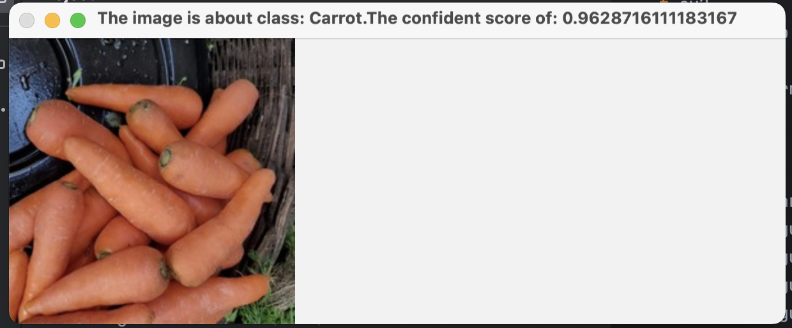
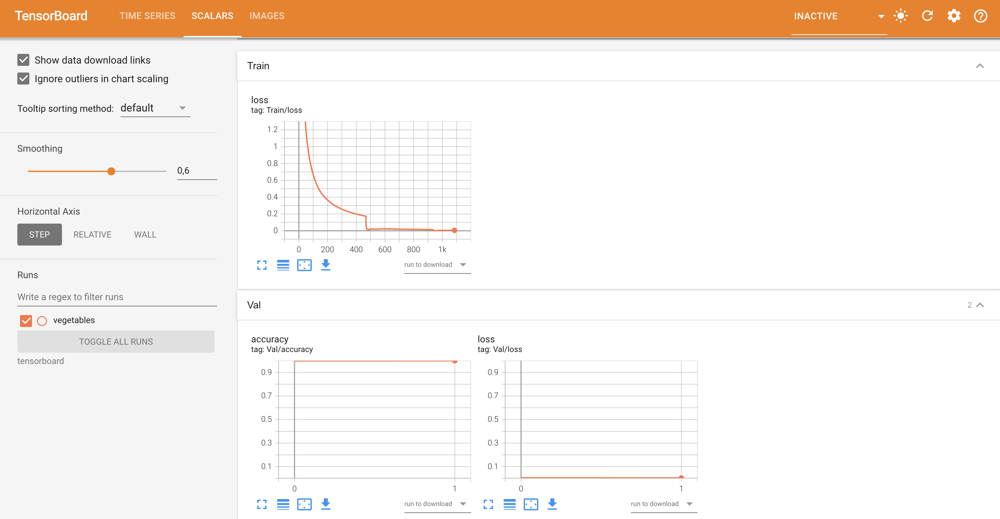
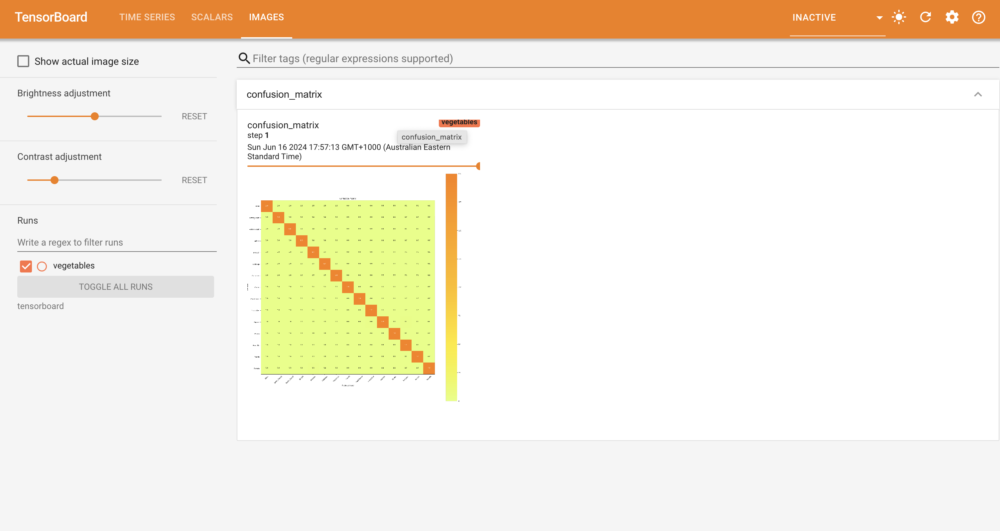
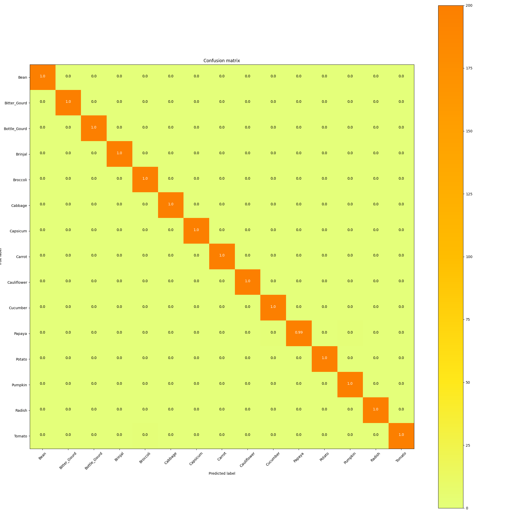
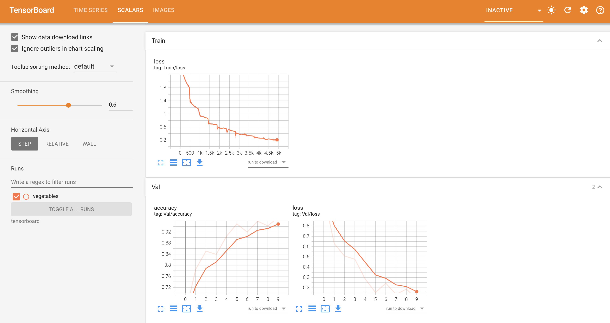
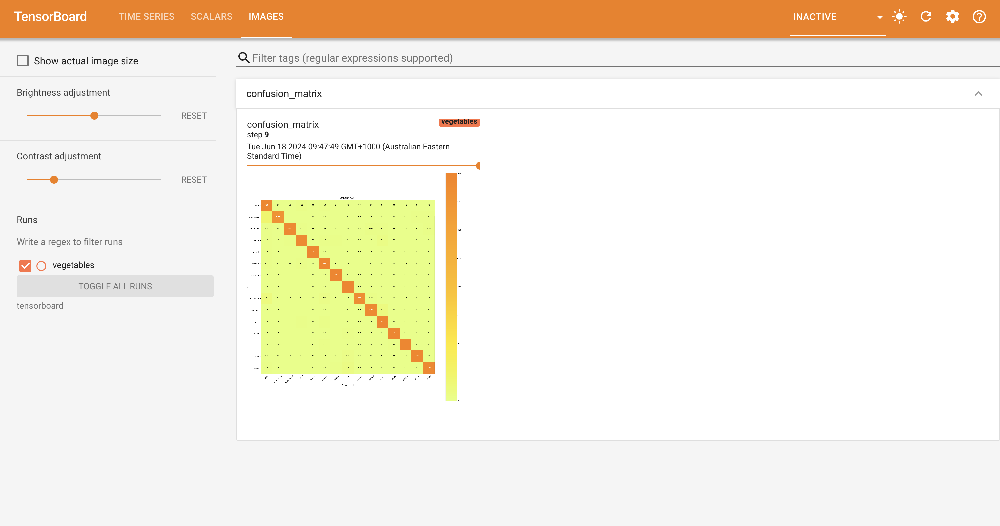

# Vegetable Classification Using Deep Learning

## Introduction

This project has implemented two deep-learning models in classifying vegetables through pictures, videos, and live feeds from cameras: a self-built CNN, and a pre-trained ResNet50 model. It was noted that the ResNet50 model performed much better in accuracy from the first epoch itself at 98%, while the custom-built model took about ten epochs before getting such performance.

## Requirements

To run this project, you will need the following libraries:

| Libraries               |
|------------------------ |
| Pytorch                 |  
| Sklearn                 |  
| OpenCV                  |   
| Numpy                   |  
| argparse                |  
| os                      |  
| shutil                  |  
| Matplotlib              |  

## File Descriptions

- **dataset.py**: Script for loading and preprocessing the dataset.
- **model.py**: Contains the architectures of both the ResNet50 and the custom CNN model.
- **train.py**: Scripts to train ResNet models, with TensorBoard integration for monitoring.
- **train_build_model.py**: Scripts to train CNN models from the file model.py, with TensorBoard integration for monitoring.
- **inference.py, inference_video.py, inference_live_camera.py**: These scripts handle inference for images, videos, and real-time camera feeds, respectively.

## How to use my code

#### - Usage -
* **Run dataset model** by running `python dataset.py`
* **Train Resnet50 model** by running `python train.py` .You can change the parameters inside it.For example: `python train.py -e 30`
* **Train CNN(self-built) model** by running `train_build_model.py` .You can change the parameters inside it.For example: `python train_build_model.py -e 50`
* **Test your trained model with image** by running `python inference.py`. For example: `python inference.py -e path/to/image.jpg`
* **Test your trained model with video** by running `python inference_video.py`. For example: `python inference_video.py -e path/to/video.mp4`
* **Test your trained model with live camera** by running `python inference_live_camera.py`

## Testing model
### --ResNet50--

  <strong><i>-Live Camera Prediction(ResNet50)-</i></strong>

https://github.com/Kevinbui16/Real-Time-Vegetable-Classification-with-Deep-Learning/assets/122188085/0303c59f-f4f6-44f2-9593-c6408fd48cbd

  The demo could also be found at: https://youtu.be/2jMpMTP0_S8

  <strong><i>-Video Prediction(ResNet50)-</i></strong>

https://github.com/Kevinbui16/Real-Time-Vegetable-Classification-with-Deep-Learning/assets/122188085/84100d43-fa46-441f-85ca-0966998b31f4

  The demo could also be found at: https://youtu.be/JpxL3SVMqXg

   
  <i>ResNet50 picture prediction demo</i>

  <strong><i>-TensorBoard Training Visualizations(ResNet50)-</i></strong>

  
  
  

     
  

### --CNN--

  <strong><i>-Live Camera Prediction(CNN)-</i></strong>

https://github.com/Kevinbui16/Real-Time-Vegetable-Classification-with-Deep-Learning/assets/122188085/f184f8b0-60a1-4b1e-800b-d7aed77b4531

  The demo could also be found at: https://youtu.be/zskBZvCnLAc

  <strong><i>-Video Prediction(CNN)-</i></strong>

https://github.com/Kevinbui16/Real-Time-Vegetable-Classification-with-Deep-Learning/assets/122188085/4079d15b-bee7-48ef-952d-b49eb35f980a

  The demo could also be found at: https://youtu.be/E7zyE_TDg-s

   
  <i>ResNet50 picture prediction demo</i>

  <strong><i>-TensorBoard Training Visualizations(CNN)-</i></strong>

  
  
  

     
  

